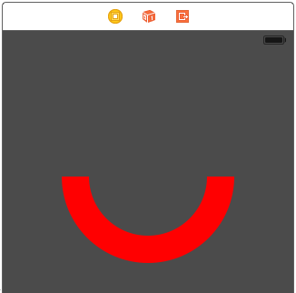
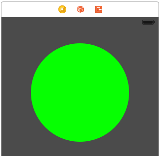

#ios-coregraphics-snippets

##Description

This repo simply contains sample code for using Core Graphics.

##Languages

Swift 2

####Jump to a Topic

[Drawing an arc](https://github.com/ccabanero/ios-coregraphics-snippets#drawing-an-arc)

[Drawing an oval](https://github.com/ccabanero/ios-coregraphics-snippets#drawing-an-oval)

[Drawing a gradient](https://github.com/ccabanero/ios-coregraphics-snippets#drawing-a-gradient)

####Drawing an arc



````
@IBDesignable
class MyView: UIView {

    override func drawRect(rect: CGRect) {

        //Draw the main path
        let color = UIColor.orangeColor()

        // center of view
        let center = CGPoint(x:bounds.width/2, y: bounds.height/2)

        // derived from max width/height dimensions of view
        let radius: CGFloat = max(bounds.width, bounds.height)

        // defines thickness of the arc
        let arcWidth: CGFloat = 50

        // start and end angles of arc
        let startAngle: CGFloat = 3 * π / 4 //note: use alt + p to get pi
        let endAngle: CGFloat = π / 4

        // create path based on center, radius, and angles
        let path = UIBezierPath(arcCenter: center,
        radius: radius/3 - arcWidth/3,
        startAngle: startAngle,
        endAngle: endAngle,
        clockwise: true)

        // set line width
        path.lineWidth = arcWidth
        color.setStroke()

        // stroke the path
        path.stroke()
    }
}
````

####Drawing an oval



````
@IBDesignable
class OvalView: UIView {

@IBInspectable var fillColor: UIColor = UIColor.greenColor()

    override func drawRect(rect: CGRect) {
        
        // create oval path
        let ovalPath = UIBezierPath(ovalInRect: rect)

        // give the current context a fill color
        fillColor.setFill()

        // fill the oval path
        ovalPath.fill()
    }
}
````

####Drawing a gradient

````
@IBDesignable
class MyView: UIView {

    @IBInspectable var startColor: UIColor = UIColor.redColor()
    @IBInspectable var endColor: UIColor = UIColor.greenColor()

    override func drawRect(rect: CGRect) {

        //(optional) set up background clipping area for rounded corners
        let path = UIBezierPath(roundedRect: rect, byRoundingCorners: UIRectCorner.AllCorners, cornerRadii: CGSize(width: 8.0, height: 8.0))
        path.addClip()

        // get the current context
        let context = UIGraphicsGetCurrentContext()

        // create gradient with - colors, color space, and color stop locations
        let colors = [startColor.CGColor, endColor.CGColor]
        let colorSpace = CGColorSpaceCreateDeviceRGB()
        let colorLocations:[CGFloat] = [0.0, 1.0]
        let gradient = CGGradientCreateWithColors(colorSpace, colors, colorLocations)

        // draw the background gradient
        let startPoint = CGPoint.zero
        let endPoint = CGPoint(x: 0, y: self.bounds.height)
        CGContextDrawLinearGradient(context, gradient, startPoint, endPoint, CGGradientDrawingOptions.DrawsAfterEndLocation)
    }
}
````
