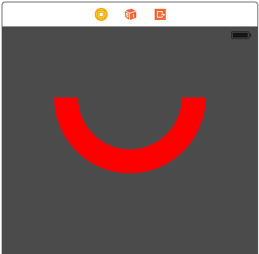

#ios-coregraphics-snippets

##Description

This repo simply contains sample code for using Core Graphics with Swift.

##Languages

Swift 2

####Jump to a Topic

[Drawing an arc](https://github.com/ccabanero/ios-coregraphics-snippets#drawing-an-arc)

[Drawing an arc (via UIBezierPath)](https://github.com/ccabanero/ios-coregraphics-snippets#drawing-an-arc-via-uibezierpath)

[Drawing a cubic bezier curve](https://github.com/ccabanero/ios-coregraphics-snippets#drawing-a-cubic-bezier-curve)

[Drawing an ellipse](https://github.com/ccabanero/ios-coregraphics-snippets#drawing-an-ellipse)

[Drawing a circle](https://github.com/ccabanero/ios-coregraphics-snippets#drawing-a-circle)

[Drawing a shadow](https://github.com/ccabanero/ios-coregraphics-snippets#drawing-a-shadow)

[Drawing a line](https://github.com/ccabanero/ios-coregraphics-snippets#drawing-a-line)

[Drawing a triangle](https://github.com/ccabanero/ios-coregraphics-snippets#drawing-a-triangle-path)

[Drawing stars](https://github.com/ccabanero/ios-coregraphics-snippets#drawing-stars)

[Drawing a rectangle](https://github.com/ccabanero/ios-coregraphics-snippets#drawing-a-rectangle)

[Drawing a gradient](https://github.com/ccabanero/ios-coregraphics-snippets#drawing-a-gradient)

[Clipping a gradient with a Path](https://github.com/ccabanero/ios-coregraphics-snippets#clipping-a-gradient-with-a-path)

####Drawing an arc


````
@IBDesignable
class CustomView: UIView {

    override func drawRect(rect: CGRect) {

        let context = UIGraphicsGetCurrentContext()

        CGContextSetLineWidth(context, 30.0)

        CGContextSetStrokeColorWithColor(context, UIColor.redColor().CGColor)

        CGContextMoveToPoint(context, 20, 100)
        CGContextAddArcToPoint(context, 20,180, 100,180, 80)

        CGContextMoveToPoint(context, 100, 180)
        CGContextAddArcToPoint(context, 180, 180, 180, 100, 80)

        CGContextStrokePath(context)
    }
}
````

####Drawing an arc (via UIBezierPath)


````
@IBDesignable
class MyView: UIView {

    override func drawRect(rect: CGRect) {

        //Draw the main path
        let color = UIColor.orangeColor()

        // center of view
        let center = CGPoint(x:bounds.width/2, y: bounds.height/2)

        // derived from max width/height dimensions of view
        let radius: CGFloat = max(bounds.width, bounds.height)

        // defines thickness of the arc
        let arcWidth: CGFloat = 50

        // start and end angles of arc
        let startAngle: CGFloat = 3 * π / 4 //note: use alt + p to get pi
        let endAngle: CGFloat = π / 4

        // create path based on center, radius, and angles
        let path = UIBezierPath(arcCenter: center,
        radius: radius/3 - arcWidth/3,
        startAngle: startAngle,
        endAngle: endAngle,
        clockwise: true)

        // set line width
        path.lineWidth = arcWidth
        color.setStroke()

        // stroke the path
        path.stroke()
    }
}
````

####Drawing a cubic bezier curve


````
@IBDesignable
class CustomView: UIView {

    override func drawRect(rect: CGRect) {

        let context = UIGraphicsGetCurrentContext()

        CGContextSetLineWidth(context, 4.0)

        CGContextSetStrokeColorWithColor(context, UIColor.yellowColor().CGColor)

        CGContextMoveToPoint(context, 0, 100)
        CGContextAddCurveToPoint(context, 25, 0, 75, 200, 100, 100)

        CGContextMoveToPoint(context, 100, 100)
        CGContextAddCurveToPoint(context, 125, 0, 175, 200, 200, 100)

        CGContextStrokePath(context)
    }
}
````


####Drawing an ellipse


````
@IBDesignable
class CustomView: UIView {

    override func drawRect(rect: CGRect) {

        let context = UIGraphicsGetCurrentContext()

        // ellipse
        let rectangle = CGRectMake(35, 50, 250, 200)
        CGContextAddEllipseInRect(context, rectangle)
        CGContextSetLineWidth(context, 10.0)

        // stroke
        CGContextSetStrokeColorWithColor(context, UIColor.greenColor().CGColor)
        CGContextStrokePath(context)
    }
}
````

####Drawing a circle 


````
@IBDesignable
class CustomView: UIView {

    override func drawRect(rect: CGRect) {

        let context = UIGraphicsGetCurrentContext()

        // ellipse
        let rectangle = CGRectMake(50, 50, 200, 200)
        CGContextAddEllipseInRect(context, rectangle)

        // stroke
        CGContextSetLineWidth(context, 4.0)
        CGContextSetStrokeColorWithColor(context, UIColor.whiteColor().CGColor)
        CGContextStrokePath(context)

        // fill
        CGContextSetFillColorWithColor(context, UIColor.greenColor().CGColor)
        CGContextFillEllipseInRect(context, rectangle)
    }
}
````

####Drawing a shadow


````
@IBDesignable
class CustomView: UIView {

    override func drawRect(rect: CGRect) {

        let context = UIGraphicsGetCurrentContext()

        // shadow
        let shadowOffset = CGSizeMake(15, 15)
        let blur = CGFloat(30)
        CGContextSetShadow(context, shadowOffset, blur)

        // ellipse
        let rectangle = CGRectMake(50, 50, 200, 200)
        CGContextAddEllipseInRect(context, rectangle)

        // fill
        CGContextSetFillColorWithColor(context, UIColor.yellowColor().CGColor)
        CGContextFillEllipseInRect(context, rectangle)
    }
}
````

####Drawing a line


````
@IBDesignable
class CustomView: UIView {

    override func drawRect(rect: CGRect) {

        // get the graphics context for the view
        let context = UIGraphicsGetCurrentContext()

        // line width
        CGContextSetLineWidth(context, 4.0)

        // stroke color
        CGContextSetStrokeColorWithColor(context, UIColor.yellowColor().CGColor)

        // line start
        CGContextMoveToPoint(context, 20, 20)

        // line end
        CGContextAddLineToPoint(context, 600, 600)

        // draw line
        CGContextStrokePath(context)
    }
}
````

####Drawing a triangle (path)


````
@IBDesignable
class CustomView: UIView {

    override func drawRect(rect: CGRect) {

        // get the graphics context for the view
        let context = UIGraphicsGetCurrentContext()

        // line width
        CGContextSetLineWidth(context, 4.0)

        // stroke color
        CGContextSetStrokeColorWithColor(context, UIColor.yellowColor().CGColor)

        // triangle path
        CGContextMoveToPoint(context, 150, 50)
        CGContextAddLineToPoint(context, 250, 250)
        CGContextAddLineToPoint(context, 50, 250)
        CGContextAddLineToPoint(context, 150, 50)

        // draw line
        CGContextStrokePath(context)
    }
}
````

####Drawing stars


````
@IBDesignable
class CustomView: UIView {

    override func drawRect(rect: CGRect) {

        drawStars(5)
    }

    private func drawStars(numberOfStars: Int) {

        let context = UIGraphicsGetCurrentContext();

        var xCenter = 40.0;
        let yCenter = 150.0;

        let w  = 50.0;
        let r = w / 2.0;
        let flip = -1.0;
        let PI = 3.14159265359

        for _ in 1...numberOfStars {

            CGContextSetFillColorWithColor(context, UIColor.yellowColor().CGColor)

            let theta = 2.0 * PI * (2.0 / 5.0); // 144 degrees

            CGContextMoveToPoint(context, CGFloat(xCenter), CGFloat(r * flip + yCenter));

            for index in 1...4 {
                let x = r * sin(Double(index) * theta);
                let y = r * cos(Double(index) * theta);
                CGContextAddLineToPoint(context, CGFloat(x + xCenter), CGFloat(y * flip + yCenter));
            }

            let spaceBetweenStars = w + 10
            xCenter += spaceBetweenStars;
        }

        CGContextClosePath(context);
        CGContextFillPath(context);
    }
}
````

####Drawing a rectangle


````
@IBDesignable
class CustomView: UIView {

    override func drawRect(rect: CGRect) {

        let context = UIGraphicsGetCurrentContext()

        CGContextSetLineWidth(context, 8)

        CGContextSetStrokeColorWithColor(context, UIColor.cyanColor().CGColor)

        // declaring the rectangle
        let rectangle = CGRectMake(60, 100, 200, 80)

        CGContextAddRect(context, rectangle)

        CGContextStrokePath(context)
    }
}
````

####Drawing a gradient


````
@IBDesignable
class MyView: UIView {

    @IBInspectable var startColor: UIColor = UIColor.redColor()
    @IBInspectable var endColor: UIColor = UIColor.greenColor()

    override func drawRect(rect: CGRect) {

        // get the current context
        let context = UIGraphicsGetCurrentContext()

        // create gradient with - colors, color space, and color stop locations
        let colors = [startColor.CGColor, endColor.CGColor]
        let colorSpace = CGColorSpaceCreateDeviceRGB()
        let colorLocations:[CGFloat] = [0.0, 1.0]
        let gradient = CGGradientCreateWithColors(colorSpace, colors, colorLocations)

        // draw the background gradient
        let startPoint = CGPoint.zero
        let endPoint = CGPoint(x: 0, y: self.bounds.height)
        CGContextDrawLinearGradient(context, gradient, startPoint, endPoint, CGGradientDrawingOptions.DrawsAfterEndLocation)
    }
}
````

####Clipping a gradient with a Path


````
@IBDesignable
class MyView: UIView {

    @IBInspectable var startColor: UIColor = UIColor.redColor()
    @IBInspectable var endColor: UIColor = UIColor.greenColor()
    
    override func drawRect(rect: CGRect) {

        // round the top left and right corners by clipping with path
        let path = UIBezierPath(roundedRect: rect, byRoundingCorners: [UIRectCorner.TopLeft,  UIRectCorner.TopRight], cornerRadii: CGSize(width: 20.0, height: 20.0))
        path.addClip()

        // get the current context
        let context = UIGraphicsGetCurrentContext()

        // create gradient with - colors, color space, and color stop locations
        let colors = [startColor.CGColor, endColor.CGColor]
        let colorSpace = CGColorSpaceCreateDeviceRGB()
        let colorLocations:[CGFloat] = [0.0, 1.0]
        let gradient = CGGradientCreateWithColors(colorSpace, colors, colorLocations)

        // draw the background gradient
        let startPoint = CGPoint.zero
        let endPoint = CGPoint(x: 0, y: self.bounds.height)
        CGContextDrawLinearGradient(context, gradient, startPoint, endPoint, CGGradientDrawingOptions.DrawsAfterEndLocation)
    }
}
````


####Adding Text (via CoreText)


````
@IBDesignable
class CustomView: UIView {

    override func drawRect(rect: CGRect) {

        if let context = UIGraphicsGetCurrentContext() {

            self.drawLine(context)
            self.drawText(context)
        }
    }

    private func drawLine(context: CGContextRef) -> Void {

        // line width
        CGContextSetLineWidth(context, 4.0)

        // stroke color
        CGContextSetStrokeColorWithColor(context, UIColor.yellowColor().CGColor)

        // triangle path
        CGContextMoveToPoint(context, 0, 100)
        CGContextAddLineToPoint(context, 50, 25)
        CGContextAddLineToPoint(context, 100, 150)
        CGContextAddLineToPoint(context, 150, 10)
        CGContextAddLineToPoint(context, 200, 200)
        CGContextAddLineToPoint(context, 250, 100)

        // draw line
        CGContextStrokePath(context)

        // flip when drawing with CoreText
        CGContextSetTextMatrix(context, CGAffineTransformIdentity)
        CGContextTranslateCTM(context, 0, self.bounds.size.height)
        CGContextScaleCTM(context, 1.0, -1.0)
    }

    private func drawText(context: CGContextRef) -> Void {

        // create path for text
        let path = CGPathCreateMutable()
        let textRect = CGRect(x: 20, y: 10, width:250, height: 21)
        CGPathAddRect(path, nil, textRect)

        // create an attributed string to represent text and styling
        let attributedString = NSMutableAttributedString(string: "Text drawn in with CoreText!")
        // text font
        attributedString.addAttribute(NSFontAttributeName, value: UIFont( name: "Helvetica", size: 17.0)!, range: NSRange(location: 0, length: attributedString.length))
        // text color
        attributedString.addAttribute(NSForegroundColorAttributeName, value: UIColor.whiteColor(), range: NSRange(location: 0, length: attributedString.length))

        // for creating frame for rendering text
        let framesetter = CTFramesetterCreateWithAttributedString(attributedString)
        let range = CFRange(location: 0, length: attributedString.length)

        // draw the text
        let frame = CTFramesetterCreateFrame(framesetter, range, path, nil)
        CTFrameDraw(frame, context)
    }
}
````